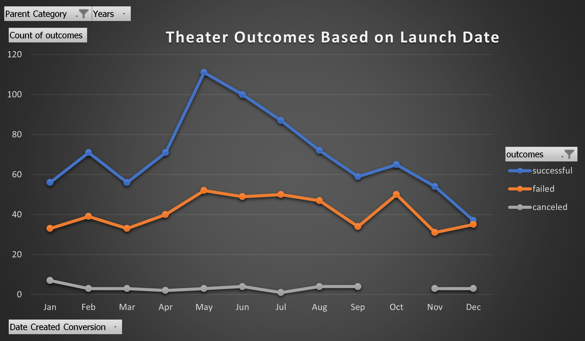
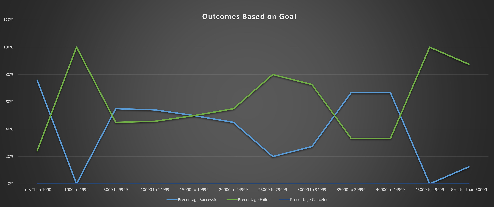

# Kickstarting Theater Campaign

## Project Overview

Over the years, the Kickstarter Campaign for theater had a 1369 crowd funding. Out of these 839 were successful and 493 failed whereas only 37 were canceled.
Outcomes based on launched month revealed that the months of May and June were the most successful and the month of April to August & October had the least number of failed outcomes.
The failed outcomes can be the direct result of the projects that reach their goals. These were less than 1000 and the percentage of successful campaign where 76% and between 5000 to 9000 mark and the percentage of successful campaign was 55%.

### Purpose
The purpose of performing this data analysis is to compare outcome performance & trends based on launch dates and funding goals. 

## Analysis and Challenges

### Analysis of Outcomes Based on Launch Date

Over the years, the Kickstarter Campaign for theater had a 1369 crowd funding. Out of these 839 were successful and 493 failed whereas only 37 were canceled. 
Outcomes based on launched month revealed that the months of May and June were the most successful and the month of April to August & October had the least number of failed outcomes.
 The successful campaign in the month of May & June could be the Spring season and the failed companies due to the summer, as the kids are out of school and mostly people plan 
 vacation during this time.
 
 

### Analysis of Outcomes Based on Goals

The analysis of outcomes based on goal indicated most of the projects that reach their goal were less than 1000 and the percentage of successful campaign where 76% and between 5000 
to 9000 mark and the percentage of successful campaign was 55%. The highest goals reached was about 50,000, but only two out of 16 total projects. 
There were high expectations regarding the amounts of money needed. 

 
### Challenges and Difficulties Encountered

The Kickstarter data was cleaned ensuring all filters and rules were disabled. A new a new column was added to capture the year the campaigns launched using the formula YEAR().
The campaign category and year were filtered in the new sheet. The outcomes were chosen as columns, the count of outcomes as values, and the date launched as rows. 
Launch dates were grouped as months in the pivot table. Lastly, the outcomes were sorted by descending. A pivot table and a line graph were created to show the visual of the outcome.
While working on this project, I encountered some challenges during the vlookup and countifs functions. The hints were very helpful and I was able to write the queries and 
perform the analysis.

## Results

- What are two conclusions you can draw about the Outcomes based on Launch Date?
May and June are popular months for launching a theater campaign. The line graph shows these months as having the highest numbers of successful campaigns.
But also, these months had the highest number of failed campaigns which can be the direct result of the goal. 
- What can you conclude about the Outcomes based on Goals?
It seems like some of the campaign goals were set without looking at the trends which ends up in higher goal and less outcomes.

- What are some limitations of this dataset?
It would be more helpful to know which location the successful campaigns were launched and the failed one and what were the reason.

- What are some other possible tables and/or graphs that we could create?
It would be helpful to create a table and a graph to match the outcomes of the campaign with the goal to see what exactly made the campaign successful pr fail in term of goals.
